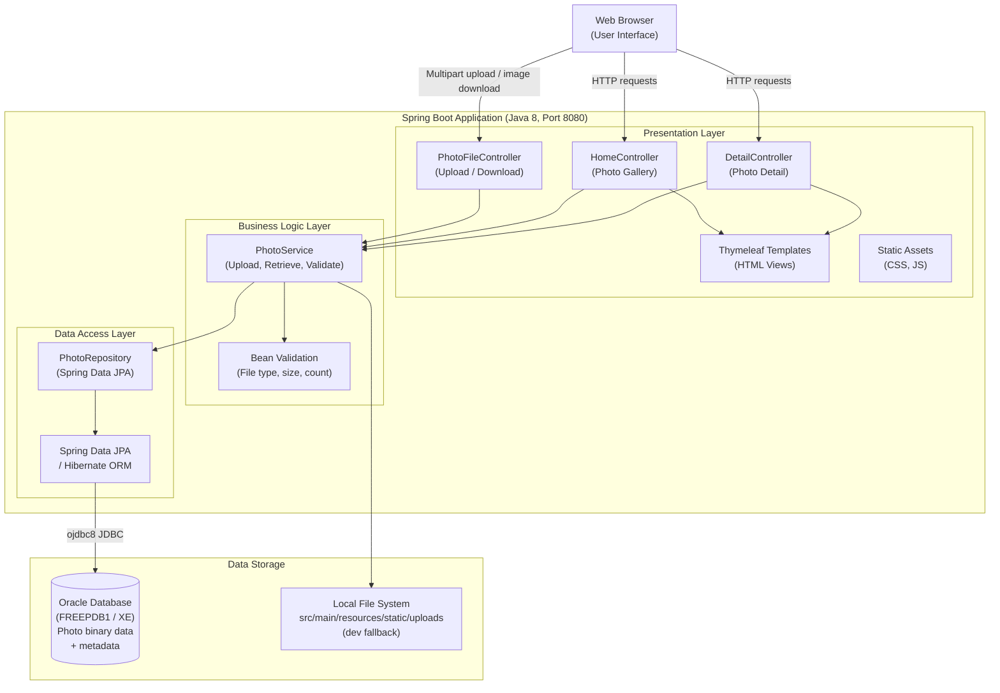

# Architecture Diagram

This diagram represents the high-level architecture of the Photo Album application, a Spring Boot web application backed by an Oracle database for photo storage and metadata management.

## Application Architecture

